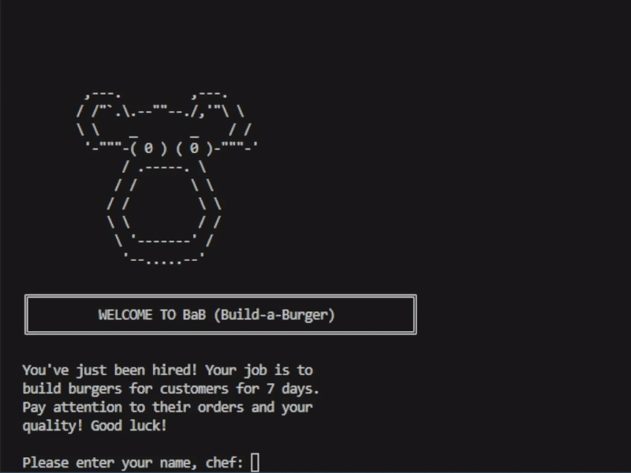

# 🍔 Build-a-Burger (BaB)

## 📋 Description / Project Overview
**Build‑a‑Burger (BaB)** is a text‑based, week‑long burger‑making simulation game where the player takes on the role of a burger shop apprentice. Over the course of seven in‑game days, the player prepares ingredients through interactive minigames, assembles customer orders, and earns ratings based on accuracy and quality. The project demonstrates core OOP principles such as abstraction, inheritance, polymorphism, and encapsulation.

The project demonstrates core **Object-Oriented Programming (OOP)** principles such as abstraction, inheritance, polymorphism, and encapsulation.

---

## 🧩 OOP Concepts Used

| OOP Principle | How It Is Used in the Program |
| :--- | :--- |
| **Abstraction** | The `Ingredient` abstract class defines shared attributes (name, quality, and minigame metrics) and declares the abstract method `performMinigame()`. Each ingredient subtype must implement this method, hiding the internal complexity of minigame logic while exposing only essential interfaces. |
| **Inheritance** | `Patty`, `Topping`, and `Sauce` inherit from `Ingredient`. They automatically gain shared fields and behaviors, allowing the program to reuse code efficiently. Each subclass also adds its own minigame mechanics while maintaining the structure defined by the parent class. |
| **Polymorphism** | The program treats all ingredient types as `Ingredient` objects when assembling a `Burger`. When `performMinigame()` is called, Java automatically executes the correct version based on the ingredient type (Patty/Topping/Sauce), enabling flexible interaction with mixed ingredient lists. |
| **Encapsulation** | Classes like `Player` and `RatingSystem` store their data privately (performance history, upgrade states, scoring values). Access is controlled through public methods such as `addRating()`, `setDailyAverage()`, and `calculateRating()`, ensuring data integrity and preventing direct manipulation. |
| **Composition** | The `Burger` class is composed of multiple ingredient objects (patty, toppings, sauces). A burger cannot exist without these components, and their lifecycle is tied to the `Burger` itself. This structure models real-world assembly while organizing ingredient management cleanly. |
| **Modularity** | The project divides responsibilities into separate classes: `BaBGame` manages game flow, `RatingSystem` evaluates quality, `CustomerTicket` generates orders, and ingredient classes handle minigames. This makes the program easier to maintain, debug, and extend. |

---

## 📂 Program Structure

```
🍔 Build-a-Burger/
├── 📂 markdown/
│   └── 🖼️ StartoftheGame.gif                   
├── 📂 src/
│   ├── 📄 Main.java             // Main entry point
│   ├── 📄 Player.java           // Player's stats, upgrades, and scores
│   ├── 📄 RatingSystem.java     // Calculates stars based on accuracy/time
│   ├── 📄 CustomerTicket.java   // Generates orders and names
│   ├── 📄 Burger.java           // Represents the final assembled burger
│   ├── 📄 Ingredient.java       // Abstract parent class
│   ├── 📄 Patty.java            // Subclass
│   ├── 📄 Topping.java          // Subclass
│   └── 📄 Sauce.java            // Subclass
├── 📄 .gitignore
└── 📄 README.md
```

---

## 🚀 How to Run the Program

### 🖥️ Running the Program

1. **Open Terminal or Command Prompt**  
   Navigate to the folder containing all your `.java` source files:  
   ```bash
   cd path/to/project
   ```
2. **Compile the Program**  
   The following command compiles every `.java` file in the directory:
   ```bash
   javac *.java
   ```
   *If there are no errors, `.class` files will be created.*
3. **Run the Main Game File**  
   Start the simulation:
   ```bash
   java BaBGame
   ```

### 🎮 Gameplay Flow

#### 🕒 Day Progression
- The game begins by displaying the **day banner** and introducing a customer.
- You will enter different **minigames** depending on the ingredient being prepared.
- After assembling the burger, the customer provides a **rating** based on accuracy and timing.

#### 📅 Seven-Day Cycle
- Gameplay continues for **seven in-game days**, each ending with:
  - Customer feedback  
  - A daily summary  
  - Possible upgrades  

#### 🏆 Final Results (After Day 7)
- When the seventh day ends, you will receive a complete breakdown of your performance:
  - ⭐ Average ratings  
  - 🏅 Achievements earned  
  - 📊 Overall performance summary  

---

## 🖥️ Sample Output

### 🏁 Start of the Game


### 🎮 Player Menu
```
╔══════════════════════════════════════════════════╗
║                  BUILD STATION                   ║
╚══════════════════════════════════════════════════╝
Remaining items to add:
  - Beef Patty
  - Beef Patty
  - Lettuce
  - Hot Sauce
  - Tomatoes
  - Hot Sauce
  - Onions
----------------------------------
What will you add?
 1. Beef Patty
 2. Toppings (Lettuce, Cheese, etc.)
 3. Sauces (Ketchup, Mustard, etc.)
 4. I'M DONE WITH THIS BURGER
----------------------------------
>
```

### 📊 Day Summary
```
╔══════════════════════════════════════════════════╗
║                   END OF DAY 1                   ║
╚══════════════════════════════════════════════════╝
Today's Customer Ratings:
  Customer 1: 4.5 Stars
  Customer 2: 5.0 Stars
----------------------------------
Daily Average: 4.8 / 5.0 Stars

[Press Enter to continue...]
```

---

## 🔮 Future Enhancement

Future updates to the Build-a-Burger game could include expanding the variety of ingredient types, introducing additional customer personalities, and enhancing the shop progression system with purchasable upgrades. A graphical user interface could also be developed to replace the text-based display, offering a more engaging and visually appealing experience. These improvements would deepen gameplay, increase replay value, and modernize the overall presentation of the project. The next player could also include earnings of the player or any price that they can get after the week-long playing of the game.

---

## 📚 References

Most of the references used in this project come from our teacher’s official course textbook and class materials. These served as the primary foundation for understanding OOP concepts and Java structure.

**Primary Reference:**  
- **Name:** Ms. Fatima Agdon  
- **Course Material:** Object-Oriented Programming in Java  
- **Institution:** Batangas State University  

---

## 👨‍🍳 Authors and Acknowledgment

| Photo | Name | GitHub |
|:-----:|------|:------:|
|  | 👨‍💻 **Macatangay, Alwyn Kent M.** | [y-kent](https://github.com/y-kent) |
|  | 👩‍💻 **Merhan, Jeily Ann S.** | [jeilyannnmerhan](https://github.com/jeilyannnmerhan) |
|  | 🧑‍💻 **Visto, Edmar D.** | [Vistoedmar10](https://github.com/Vistoedmar10) |


